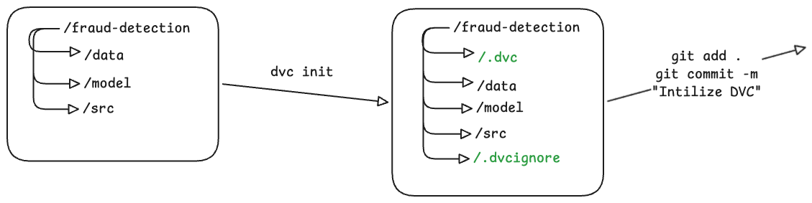

This is a straightforward DVC initialization task inside an existing Git repository.

### Step 1: Navigate to the repository

```bash
cd /root/code/fraud-detection
```

### Step 2: Initialize DVC

```bash
dvc init
```

This creates:

* `.dvc/`
* `.dvcignore`

### Step 3: Stage the DVC files

```bash
git add .dvc .dvcignore
```

### Step 4: Commit the changes

```bash
git commit -m "Initialize DVC"
```

### Verify

```bash
git log --oneline -1
```

Expected latest commit:

```text
Initialize DVC
```

You can also verify DVC initialization:

```bash
dvc version
ls -la
```

You should see:

```text
.dvc/
.dvcignore
```

Complete command sequence:

```bash
cd /root/code/fraud-detection
dvc init
git add .dvc .dvcignore
git commit -m "Initialize DVC"
```

### Why each step is needed

* `dvc init` sets up DVC metadata and configuration inside the Git repository.
* `git add .dvc .dvcignore` tracks the DVC configuration files in Git.
* `git commit -m "Initialize DVC"` records the repository's transition to a DVC-enabled project, allowing all team members to pull the configuration and use DVC consistently.


